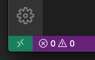
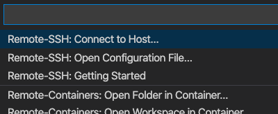
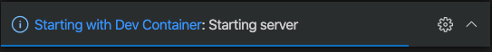
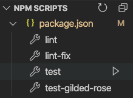

# 單元測試工作坊

課程教材：

https://bit.ly/2ZNs3Jj

## 目錄

- [Calculator](src/first-unit-test)
- [Coverage](src/coverage)
- [Driving Licence](src/mock/driving-licence)

## 開發環境

- 語言：[TypeScript](https://www.typescriptlang.org/)
- 執行環境：[Node.js](https://nodejs.org/)
- 測試框架：[Jest](https://jestjs.io/)

課程使用 [VS Code Remote Development](https://code.visualstudio.com/docs/remote/remote-overview) 作為開箱即用的練習環境，
請參考以下說明設定。

> 參考自 https://code.visualstudio.com/docs/remote/containers-tutorial

### 安裝 Docker

https://www.docker.com/products/docker-desktop

### 安裝 VS Code 編輯器

https://code.visualstudio.com/Download

### 安裝 Remote Development Extension

https://marketplace.visualstudio.com/items?itemName=ms-vscode-remote.vscode-remote-extensionpack

### 啟動開發環境

下載課程原始碼：

```console
git clone https://github.com/minchao/unit-testing
```

接下來開啟剛剛安裝的 VS Code，在編輯器的左下方會出現一個 Remote status bar 項目。



點擊後，選擇 Remote-Containers: Open Folder in Container...，挑選剛剛 git clone 的 unit-testing 資料夾。



容器即自動編譯並啟動，這裡可能需要等待一點時間。



### 檢查開發環境

待容器準備就緒後，您可以透過打開 VS Code 的 Terminal > New Terminal 並輸入以下指令，確定是否一切正常：

```console
$ node --version; yarn --version; tsc --version
v14.5.0
1.22.4
Version 3.9.7
```

安裝依賴套件：

```console
$ yarn
```

最後，我們來執行一個預先建立的單元測試指令，在 Terminal 中輸入：

```console
$ yarn run test
```

或使用 VS Code 的 GUI 來執行：



> 這個 test 指令被定義在 [package.json](package.json) 的 scripts 區段內，它會執行完整的單元測試，並輸出覆蓋率報告到專案的 coverage 資料夾下。
> 您也可以試試其它指令，例如，單獨執行某一個練習的單元測試。
